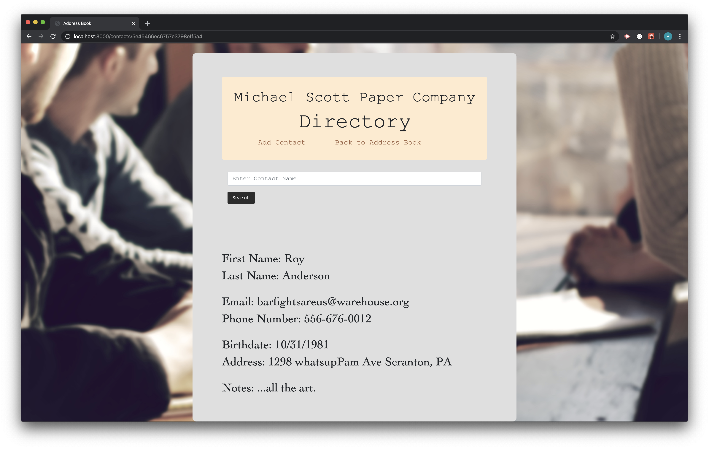

# Address-Book

## Address-Book is a full-stack web app that provides an address book for the user. It's theme is established currently as a public directory for employees of the fictitious - Michael Scott Paper Company.  

## Technologies used:
1. ReactJs
2. NodeJs
3. Express
4. MongoDB
5. Node-fetch
6. Mongoose
7. NPM
8. Fetch API

## The application works by letting the user create an address book. Once a contact is created the user has the ability to edit or delete that contact. A search bar allows the user to find contacts already established in the address book. A detailed view of the contacts information is provided when a contact is selected. Contacts are displayed for the user in alphabetical order by last name.

## To compile and run application:
###  Source code from my repo can by forked. NPM install Mongoose, Axios and Express. User will also need  MongoDB database application installed locally.
### Once all dependencies are installed the program can be run first by opening terminal and establishing a connection to MongoDB (see MongoDB docs for requirements on your computer). Then starting the server file in node via terminal and inserting command npm start. 

## View castify demo here --->>  https://drive.google.com/file/d/1C6dOIf9mV0lagAcQQ5eHWCqyQv_6fEy4/view

